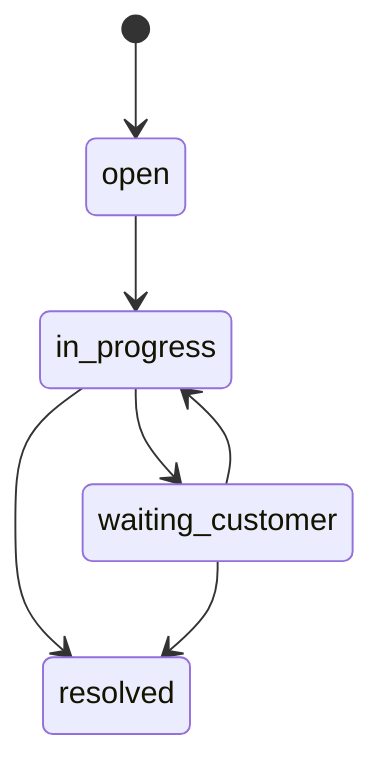

# ServiceHub

A support operations platform for managing customer tickets, SLA risk, ownership, and team workload. The project focuses on application concerns that matter in real internal tools: access control, searchable data, state transitions, auditability, and operational metrics.

## Features

- Ticket queue with search, priority, status, and assignee filters.
- SLA risk indicators derived from priority and ticket age.
- Isolated demo identity middleware that can be replaced by production authentication without coupling auth to ticket-domain logic.
- Team workload and first-response metrics.
- Request validation, rate limiting, secure headers, and centralized errors.
- MongoDB-backed repository with Docker-based local setup.

## Stack

**Vue 3 · TypeScript · Pinia · Node.js · Express · MongoDB · REST APIs · Docker · GitHub Actions**

## Ticket workflow



Ticket status changes are handled through explicit transition rules. That keeps workflow behavior testable and prevents arbitrary state changes from the client.

## Local setup

```bash
cp .env.example .env
docker compose up -d mongo
cd services/api && npm install && npm run dev
cd ../../apps/web && npm install && npm run dev
```

The demo API attaches a local agent identity in `services/api/src/auth.ts`; send `x-demo-role: lead` when testing lead behavior.

## API examples

```http
GET   /api/tickets?priority=high&status=open&query=payment
PATCH /api/tickets/:id/status
GET   /api/metrics/overview
```

## Security notes

- Authentication is represented by isolated demo middleware so production JWT/OIDC can replace it without changing ticket-domain code.
- The API never relies on the browser to validate ticket state transitions.
- Validation rejects unknown/invalid state transitions before persistence.

## Author

**Rahul Kumar Maurya** · Full Stack Developer · Toronto, ON  
GitHub: [rahulk030](https://github.com/rahulk030)
